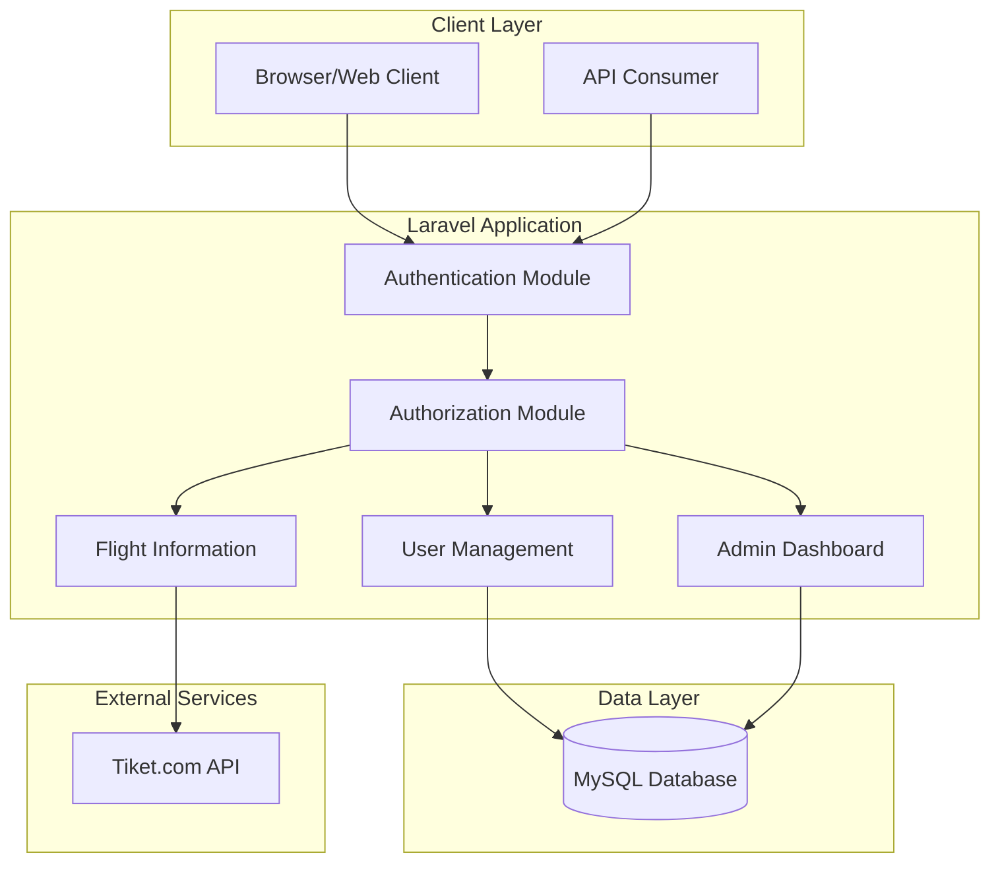
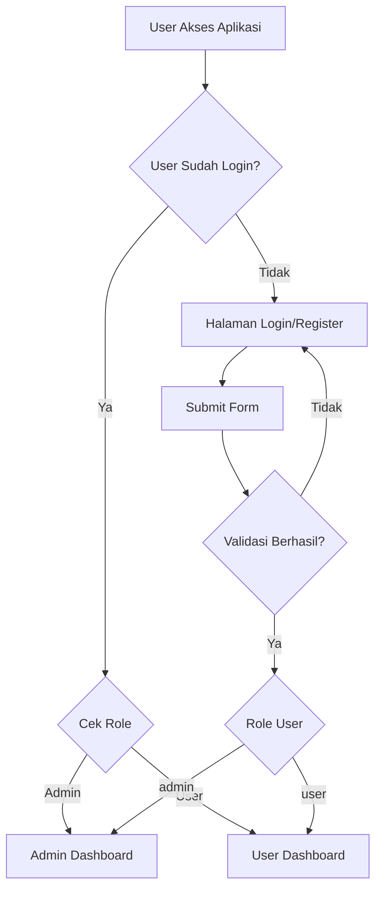
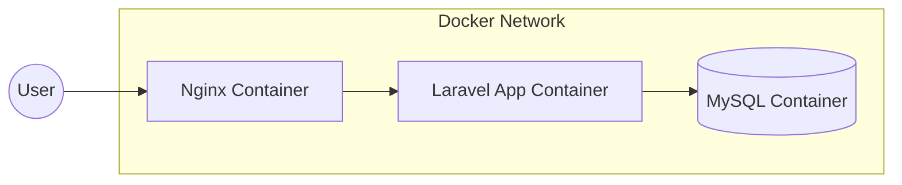

# Rencana Implementasi Technical Test Tablelink - Laravel 12

## 1. Gambaran Proyek

Proyek ini adalah aplikasi web Laravel 12 dengan autentikasi, otorisasi berbasis role (Admin/User), manajemen pengguna, dashboard admin dengan charts, dan fitur Flight Information dari Tiket.com.

## 2. Arsitektur Sistem



## 3. Struktur Database

### Tabel Users

| Field      | Tipe      | Deskripsi           |
| ---------- | --------- | ------------------- |
| id         | bigint    | Primary key         |
| name       | string    | Nama lengkap        |
| email      | string    | Email (unik)        |
| password   | string    | Password ter-hash   |
| role       | enum      | 'admin' atau 'user' |
| last_login | timestamp | Login terakhir      |
| created_at | timestamp | Waktu dibuat        |
| updated_at | timestamp | Waktu diperbarui    |
| deleted_at | timestamp | Soft delete         |

## 4. Flowchart Autentikasi & Otorisasi



## 5. REST API Endpoints

### Authentication

- `POST /api/auth/register` - Registrasi user baru
- `POST /api/auth/login` - Login user
- `POST /api/auth/logout` - Logout user
- `GET /api/auth/me` - Get current user

### User Management (Admin only)

- `GET /api/users` - List users (pagination 10 per halaman)
- `GET /api/users/{id}` - Get user details
- `PUT /api/users/{id}` - Update user
- `DELETE /api/users/{id}` - Soft delete user

### Dashboard Data

- `GET /api/dashboard/users-chart` - Data untuk line chart
- `GET /api/dashboard/roles-chart` - Data untuk pie chart
- `GET /api/dashboard/activity-chart` - Data untuk bar chart

### Flight Information

- `GET /api/flights` - Data flight dari Tiket.com

## 6. Struktur MVC Laravel

```
app/
├── Http/
│   ├── Controllers/
│   │   ├── AuthController.php
│   │   ├── UserController.php
│   │   ├── DashboardController.php
│   │   └── FlightController.php
│   ├── Middleware/
│   │   ├── RoleMiddleware.php
│   │   └── Authenticate.php
│   └── Requests/
│       ├── RegisterRequest.php
│       ├── LoginRequest.php
│       └── UpdateUserRequest.php
├── Models/
│   └── User.php
├── Services/
│   ├── AuthService.php
│   ├── UserService.php
│   └── FlightService.php
└── Providers/
    └── AuthServiceProvider.php

resources/
└── views/
    ├── components/
    │   ├── charts/
    │   │   ├── line-chart.blade.php
    │   │   ├── bar-chart.blade.php
    │   │   └── pie-chart.blade.php
    │   └── table/
    │       └── flight-table.blade.php
    ├── auth/
    │   ├── login.blade.php
    │   └── register.blade.php
    ├── dashboard/
    │   ├── admin.blade.php
    │   └── user.blade.php
    └── flights/
        └── index.blade.php
```

## 7. Docker Architecture



### docker-compose.yml Services:

1. **nginx** - Web server
2. **app** - Laravel application (PHP-FPM)
3. **db** - MySQL database
4. **composer** - For running composer commands

## 8. Fitur Utama

### 8.1 Autentikasi

- Register dengan email unik
- Login dengan email/password
- Update last_login saat login berhasil

### 8.2 Otorisasi

- Role: Admin dan User
- Middleware untuk proteksi routes
- Policy untuk otorisasi detail

### 8.3 Manajemen User (Admin)

- List users dengan pagination
- Update user (email unik, exclude current user)
- Soft delete user

### 8.4 Dashboard Admin

- Line Chart: User registration over time
- Bar Chart: User activity
- Pie Chart: User distribution by role

### 8.5 Flight Information

- Scrape data dari Tiket.com
- Filter: CGK → DPS, one-way, before 17:00, ekonomi
- Tampilkan dalam data table

## 9. Testing Strategy

### Unit Tests:

1. **AuthenticationTest**
   - test_user_can_register
   - test_user_can_login
   - test_user_cannot_login_with_invalid_credentials

2. **AuthorizationTest**
   - test_admin_can_access_admin_routes
   - test_user_cannot_access_admin_routes

3. **UserCrudTest**
   - test_admin_can_create_user
   - test_admin_can_update_user
   - test_admin_can_delete_user
   - test_soft_delete_works

4. **DashboardTest**
   - test_dashboard_returns_correct_data
   - test_chart_data_format

## 10. Keamanan

- Password di-hash dengan bcrypt
- Middleware berbasis role
- Soft delete untuk data user
- Validasi request dengan Form Request
- CORS configuration untuk API

## 11. Langkah Implementasi

### Fase 1: Setup Project

1. Install Laravel 12
2. Setup Docker environment
3. Konfigurasi database

### Fase 2: Core Features

1. User migration dan model
2. Authentication (login/register)
3. Role-based access control
4. User management CRUD

### Fase 3: Dashboard & Charts

1. Admin dashboard view
2. Chart.js integration
3. REST API untuk chart data
4. Reusable chart components

### Fase 4: Flight Information

1. Flight service untuk scraping
2. API endpoint untuk flights
3. Flight information page

### Fase 5: Testing & Finalization

1. Unit tests
2. Integration tests
3. Code review dan polish
